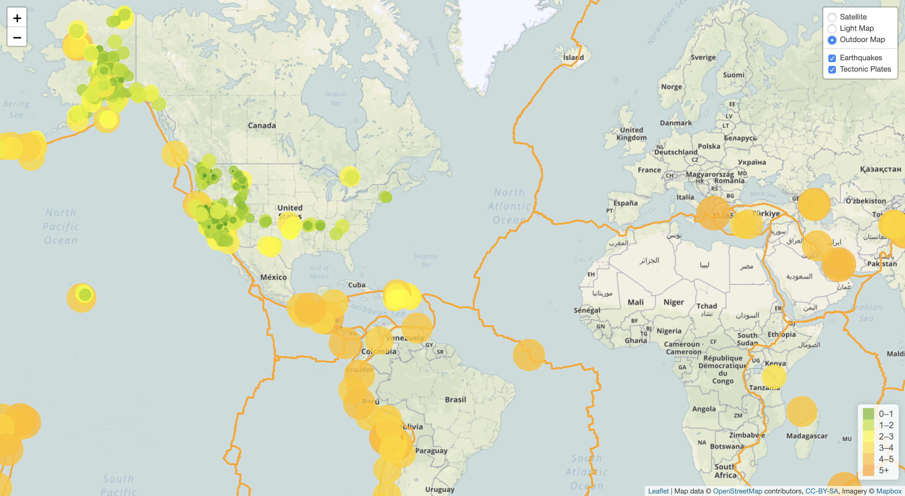

# Earthquake-Visualizations
This is a visualization of earthquake data and tectonic plates. This visualization is completed using HTML, JavaScript, GeoJSON, Leaflet.js.

In order to run the vizualizations you will need your own API key from mapbox.com. Then create a file named config.js and place it in the js folder. Within this create a var config = { MY_KEY: 'Your API Key here'}.
